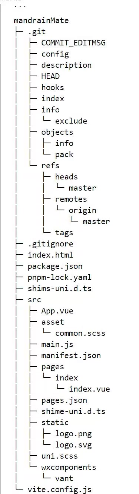
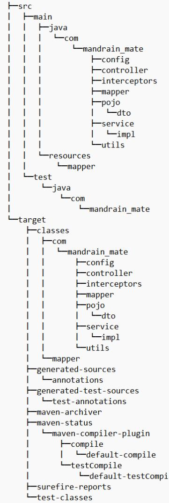

# **语伴**

  
Mandarin-Mate 

  

## **项目介绍**
  本项目是一款专注于汉语自主学习的软件,以纠正用户发音为核心，通过深度卷积神经网络、语音识别等技术，为用户提供个性化学习建议和丰富的学习资源，实现了一个便捷高效的多功能语言学习平台。  
  语伴使用Spring Boot和uniapp进行开发，并利用vue3技术与vite项目包配置工具对项目进行业务开发以及项目管理。
## **系统架构**
## **核心技术栈**

### **前端**

                                                                                        
### **后端**

## **功能模块**

    
### **2.拾音**
   作为语伴的核心功能该功能穿插到了整个学习过程中，通过语音输入，在不进入学习页面的情况下便可进行发音练习。该功能位于软件tab栏中心，可以针对只进行语音练习的用户，通过语音识别对汉语进行翻译供用户参考学习。可从语音中提取文本信息，并通过语料库检索，提取相应的单词，句式。

### **3.复习**
   用户可定制每天的复习量，按照用户发音评分排名，取后40%的内容和从已学中抽取部的部分内容进行复习。根据艾宾浩斯遗忘曲线，分别在24小时、7天、30天、90天推送指定复习内容。等周期结束便在新的学习关卡中抽取内容进行复习。

 ### **4.学习圈**
    在这里用户可以与其他学习汉语的人进行交流，在聊天时的每句话都会带有汉语翻译。此外，还提供了类似朋友圈的功能，用户 
    可以分享学习心得，同时拾音功能可以帮助用户识别好的发音。

    

## **软件预览**
