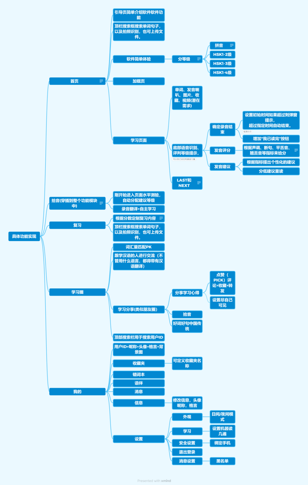
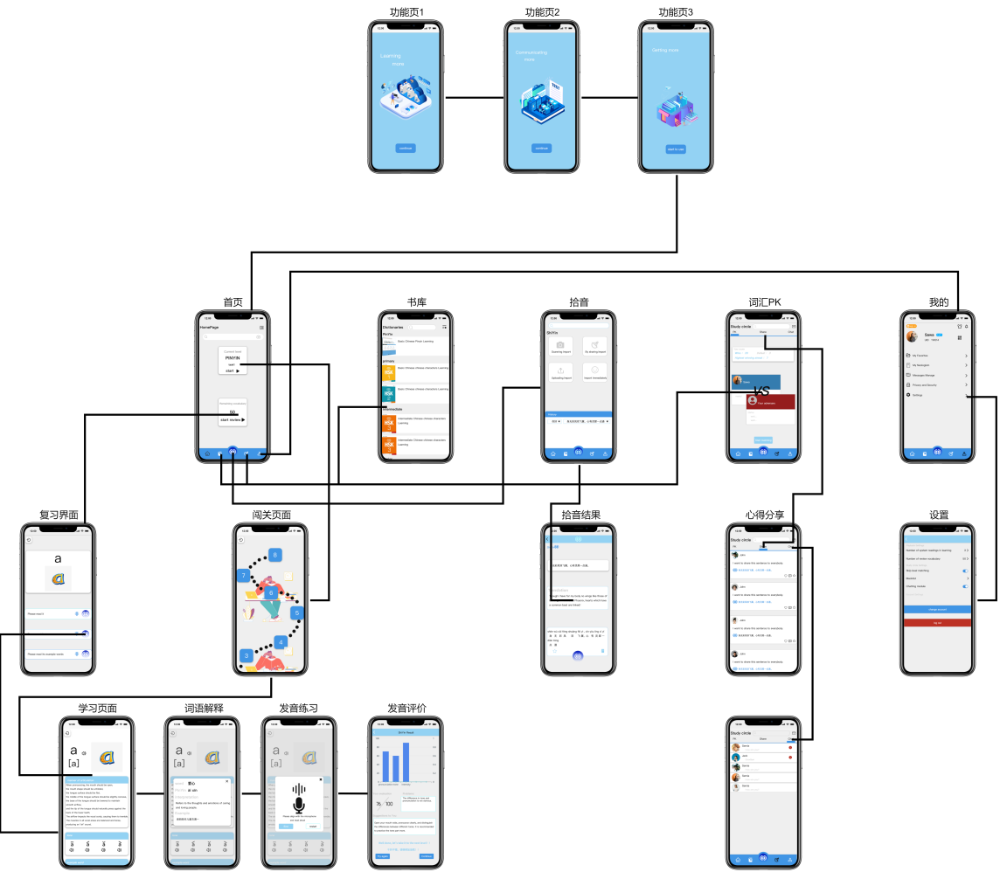

# **语伴**

  
Mandarin-Mate 

  

[后端开发]: (https://github.com/KeepLjx/Mandarin-Mate-Server)

# **项目介绍**
  本项目是一款专注于汉语自主学习的软件,以纠正用户发音为核心，通过深度卷积神经网络、语音识别等技术，为用户提供个性化学习建议和丰富的学习资源，实现了一个便捷高效的多功能语言学习平台。  
  语伴使用Spring Boot和uniapp进行开发，并利用vue3技术与vite项目包配置工具对项目进行业务开发以及项目管理。

# **技术架构**

## **前端技术选型**

|         技术         |  版本   |        说明        |
| :------------------: | :-----: | :----------------: |
|         Vue          | 3.2.45  |    界面搭建框架    |
|        Pinia         | 2.0.36  |  公共数据管理工具  |
|     tailwindcss      |  3.4.1  |  界面样式构建框架  |
|        uniapp        |  3.0.0  | 跨平台程序开发框架 |
|         vite         |  4.0.3  |   项目工程化框架   |
| 微信小程序开发基础库 |  3.4.3  | 小程序开发依赖平台 |
|         tmui         | 3.0.89  |  小程序开发组件库  |
|       u-charts       |  2.5.0  |    跨平台图表库    |
|         yarn         | 1.22.22 |     包管理工具     |

                                                                                        

## **功能模块**

### **1.首页**
对于新用户来说，首先引导页简单介绍软件的主要功能，新用户可以不用注册便可简单体验学习内容，针对汉语掌握程度不同的用户我们设置了不同等级，可以提供与之水平匹配的学习内容。  
语伴的主要特色就是纠正用户的汉语发音，再此基础上加入词汇书、句法书供用户学习。页面顶栏搜索框可用于搜索单词句子，拍照识别，也可上传文件，进行文件翻译。对于如何确定录音结束等问题，软件中设置了初始时间自动结束，通过检测分贝来判断语音是否输入结束，另外增加“我已读完”按钮。在学习页面中，设置了语音识别、评判等级等功能，根据声调、短句、发音等指标对用户语音输入进行打分，并根据打分结果给出个性化建议。
    
### **2.拾音**
作为语伴的核心功能,该模块通过语音输入，在不进入学习页面的情况下便可进行发音练习。该功能位于软件tab栏中心，可以针对只进行语音练习的用户，通过语音识别对汉语进行翻译供用户参考学习。可从语音中提取文本信息，并通过语料库检索，提取相应的单词，句式。

### **3.复习**
用户可定制每天的复习量，按照用户发音评分排名，取后40%的内容和从已学中抽取部的部分内容进行复习。根据艾宾浩斯遗忘曲线，分别在24小时、7天、30天、90天推送指定复习内容。等周期结束便在新的学习关卡中抽取内容进行复习。

### **4.学习圈**
在这里用户可以与其他学习汉语的人进行交流，在聊天时的每句话都会带有汉语翻译。此外，还提供了类似朋友圈的功能，用户可以分享学习心得，同时拾音功能可以帮助用户识别好的发音。

### **5.我的**
包括收藏夹、错词本、我的语伴、消息、用户信息、设置等功能模块。
    

## **软件预览**

